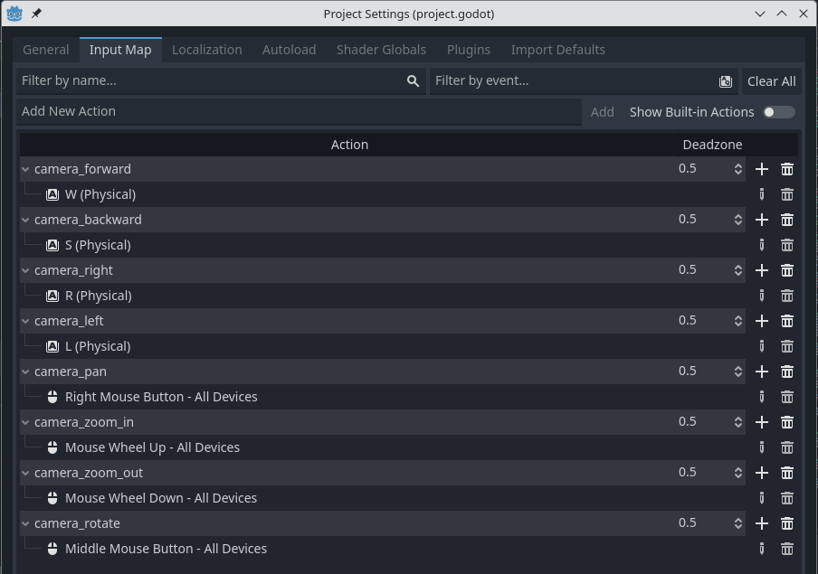
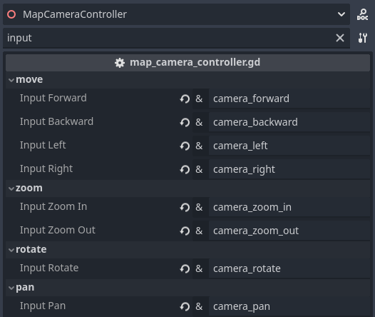

# Godot-3D-MapCameraController
Camera controller for RTS, TBS. Created using Godot version 4.2

## Features
* MOVE - moving the camera in two asix (horizontal plane) parallel to the map, usually by WASD in keyboard
* PAN - moving the camera in two asix (horizontal plane) parallel to the map by mouse
* ZOOM - camera zoom in one asix, usually by mouse scroll wheel
* RORATE - rotate camera in two asix by mouse move, usually by middle mouse button

## Usage
* From repository downoad folder /MapCameraControllerProject/MapCameraController
* Copy this folder to your Godot project
* In "Input Map" add missing action (names of your choice), example:

* Add map_camera_controller.tscn to your scene
* Change properties MapCameraController - set names actions, example:

### You can also download and open the demo project /MapCameraControllerProject